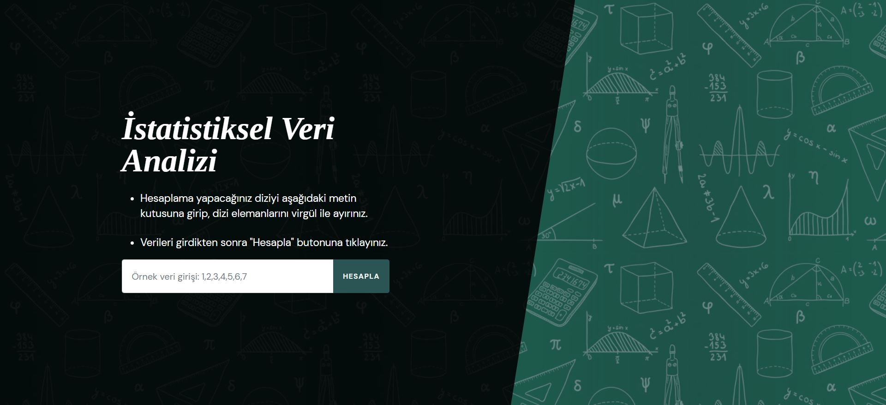
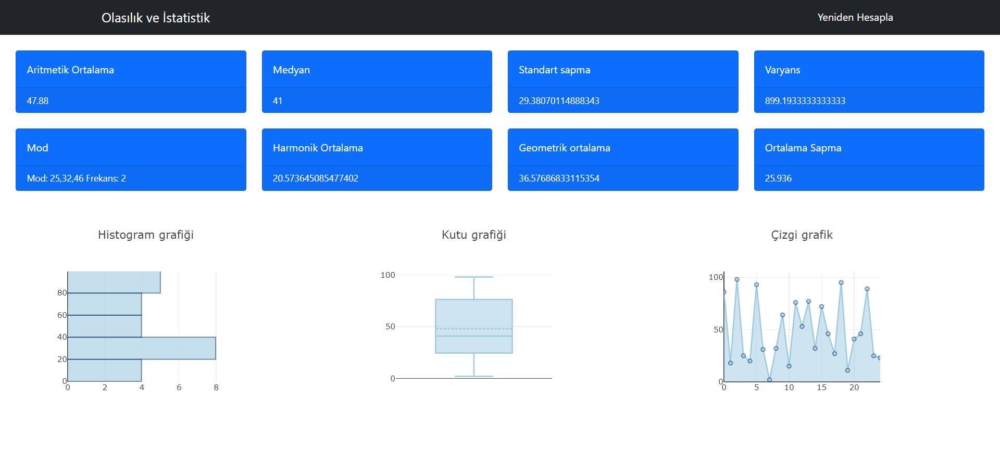

# 🧮Olasılık ve İstatistik Dersi Vize-Grup Ödevi

## Siteye buradan ulaşabilirsiniz.
👉 [Site Linki]() 👈

Bu site sayesinde, siteye veri girişi yapabilirsiniz.
Girişini yaptığınız veri topluluğuyla ilgili;

- Aritmetik Ortalama
- Medyan
- Standart Sapma
- Varyans
- Mod 
- Harmonik Ortalama
- Geometrik Ortalama
- Ortalama sapma

gibi değerlere ulaşabilirsiniz.

# Site içi Görüntüler

Verilerinizin girişini yapacağınız giriş bölümü:

⚠️ Veri girişinizi yaparken verilerinizin arasına <b>","</b> koyarak giriniz.

Veri topluluğunuzun değerlerini görebileceğiniz içerik bölümü:

# Kullanılan Teknoljiler

- HTML5
- CSS3
- Bootstrap5
- JavaScript

# Ekip Üyeleri

- [Selçuk Şan](https://github.com/selcuksan)
- [Ahmet Mert Öz](https://github.com/ahmetmert1)
- [Sefa Enes Ergin](https://github.com/sefaenesergin) 

